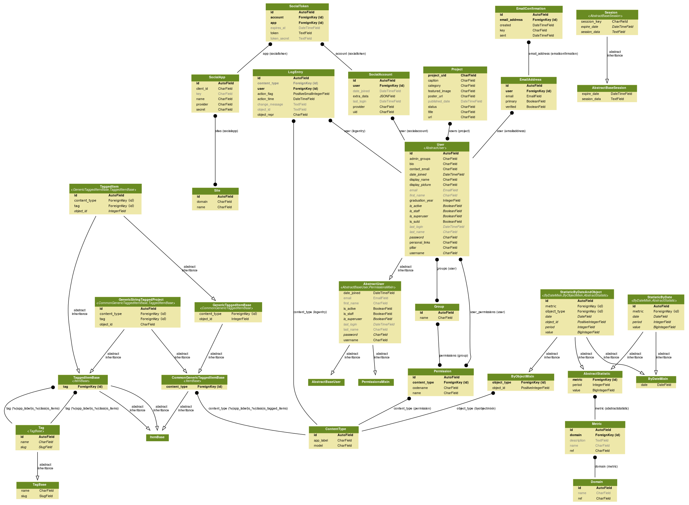

# web-platform-prototype

[](https://app.codacy.com/app/tlkh/web-platform-prototype?utm_source=github.com&utm_medium=referral&utm_content=OpenSUTD/web-platform-prototype&utm_campaign=Badge_Grade_Settings)

Prototype for the Eventual OpenSUTD Web Platform

## Database setup

Database will not be pushed to github (will be local on your computer). Run migration to create the DB according to the models specified in the code.

```
python3 manage.py makemigrations
python3 manage.py migrate

# create dashboard admin user
python3 manage.py createsuperuser
```

## Running the application server for development

```
# to reset the database back to sample values
scripts/refresh_db.sh

# for development without docker
python3 manage.py runserver

# running with docker
# - map port 8000 to port 80
# - mount local folder
TAG=0.2-dev
docker run --rm \
 -p 80:8000 \
 -v /home/$USER/web-platform-prototype:/app \
 opensutd/web-platform:$TAG \
 python3 manage.py runserver 0:8000

# testing packaged application
docker run --rm -it -p 80:8000 opensutd/web-platform:$TAG python3 manage.py runserver 0:8000
```

## Running the built-in tests

```
TAG=0.2-dev
docker run --rm opensutd/web-platform:$TAG python3 manage.py test
```

## Synchronizing your fork to upstream (OpenSUTD repo)

```
# one time setup
git remote add upstream https://github.com/OpenSUTD/web-platform-prototype

# pull upstream changes
git fetch upstream
git merge upstream/master
git push
```

## Data Model

